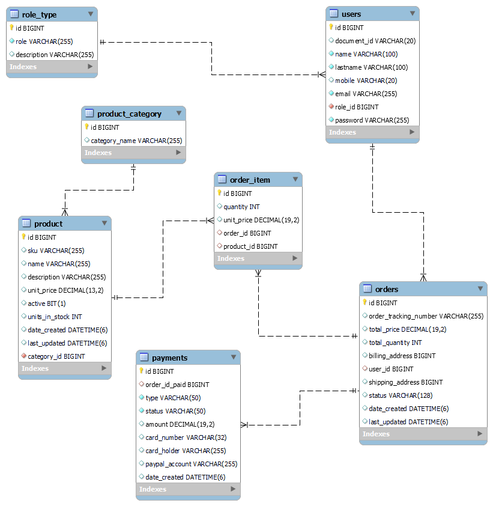

# order payment service API

Service defined over an hexagonal and clean architecture approach, this api creates orders with multiple products

In this project, I applied the hexagonal and Clean Architecture approach. This approach defines separate modules, such as the Domain module (which includes business logic, models, and use cases) and the Infrastructure module (which includes adapters, entry points, REST clients, etc.). In the business layer, I create contracts that define what the API should do, but not how it should be done. The infrastructure layer then implements these contracts.

## Table of Contents

- [Installation](#installation)
- [Relational model diagram](#diagram)
- [Endpoints](#endpoints)
- [Contributing](#contributing)
- [License](#license)

## Installation

1. Execute scripts database located in api user service https://github.com/gitUserDiegoS/ecommerce-user-service

   1.1. Execute script in `scripts/sdscrits.sql` to create and populate initial records
   1.2. Go to develop branch and run the application


Url base de  local: `http://localhost:8083`.

## Relational model diagram


## Endpoints

### 1. POST - Registrar citas médicas

`http://localhost:8083/api/v1/orders`

**Request:**

```json
{
  "userId": 1,
  "items": [
    {
      "productId": 1,
      "quantity": 2
    },
    {
      "productId": 2,
      "quantity": 1
    }
  ]
}
```

**Response (HTTP 200):**

```json
{
  "id": 1,
  "orderTrackingNumber": "d977e379-73d0-460c-a0f1-17ae161570d1",
  "totalPrice": 50.97,
  "totalQuantity": 3,
  "status": "PENDING",
  "dateCreated": "2025-10-27",
  "items": [
    {
      "productId": 1,
      "quantity": 2
    },
    {
      "productId": 2,
      "quantity": 1
    }
  ]
}
```


